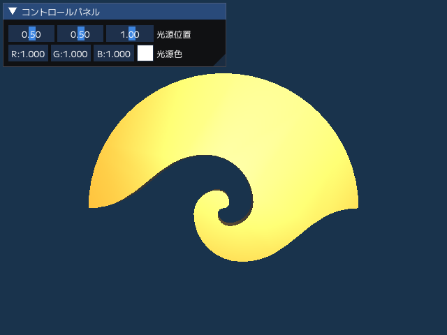

# ggsample01

## ゲームグラフィックス特論A　第１回　宿題

OpenGL の開発環境を整備してください。

* 宿題のひな形は [GitHub](https://github.com/tokoik/ggsample01) にあります
 (宿題のひな形で使っている[補助プログラムの解説](https://tokoik.github.io/gg/html/annotated.html))。
* 詳しくは[講義のスライド](https://tokoik.github.io/gg/ggnote01.pdf)を参照してください。

## 宿題プログラムの作成に必要な環境

* Linux Mint 18.3 / Windows 10 (Visual Studio 2017) / macOS 10.15 (Xcode 11) 以降に対応しています。
* OpenGL 4.1 以降が実行できる環境 (対応した GPU を搭載したビデオカード や CPU) が必要です。

## 補足

このプログラムを実行すると、次のような図形が表示されます。

 

* 今回はソースプログラムを修正していないので送る必要はありません。
* ひな形プログラムがコンパイル／実行できなかったら知らせてください。
* fork 推奨ですが解答をプルリクで受け取る気力はないと思います。

## 宿題プログラム用補助プログラムについて

ゲームグラフィックス特論 A / B で課す宿題プログラムでは、専用の補助プログラムを用意しています。これは以下の 3 つのファイルで構成されています。

* gg.h / gg.cpp
    * GLFW での利用を想定した OpenGL のローダとユーティリティ
* Window.h
    * ウィンドウやマウス関連のユーザインタフェースを管理する GLFW のラッパー

[GLFW](https://www.glfw.org/) は [OpenGL](https://www.opengl.org/) や、その後継の Vulkan を使用したアプリケーションを作成するための、非常にコンパクトなフレームワークです。本当はこれだけで簡単にアプリケーションが作れるのですが、授業内容とはあまり関係のない処理を分離するために、屋上屋ながら**この授業専用の**フレームワークを用意しました。なお、gg.h / gg.cpp には OpenGL の拡張機能を使用可能にする機能を含んでいるので、別に [GLEW](http://glew.sourceforge.net/) や [glad](https://github.com/Dav1dde/glad)、[GL3W](https://github.com/skaslev/gl3w) などを導入する必要はありません。また Window.h には、[Dear ImGui](https://github.com/ocornut/imgui) をサポートする機能と、Oculus Rift (DK1, DK2, [CV1](https://www.oculus.com/rift/), [S](https://www.oculus.com/rift-s/)) をサポートする機能を組み込んでいます。これを使って、C++ だけで VR アプリケーション () が作れます。

### 補助プログラムのドキュメント

Doxygen で生成したドキュメントの [HTML 版](html/index.html)を html フォルダに、[PDF 版](pdf/refman.pdf)を pdf フォルダに置いています。

### 補助プログラムの使い方

補助プログラムを使用するには、最小限、GLFW が使える環境が必要です。ゲームグラフィックス特論 A / B の宿題のリポジトリには Windows 用、macOS 用、および Linux 用にコンパイルしたライブラリファイル一式を含めていますので、宿題のために別に用意する必要はありません。gg.h, gg.cpp, Window.h だけを使うときは、それぞれの環境で GLFW をインストールしておいてください。この補助プログラムを使用した最小のプログラムは、多分こんな感じになります。このソースファイルと同じところに gg.h, gg.cpp, Window.h を置き、gg.cpp と一緒にコンパイルして、GLFW のライブラリファイルをリンクしてください。

```cpp
#include "Window.h"

int main()
{
    Window::init();

    Window window;

    while (window)
    {
        //
        // ここで OpenGL による描画を行う
        //
    }
}
```

使用する OpenGL のバージョンは、`Window::init(major, minor)` の `major` と `minor` で指定できます。`major` を 0 にするか省略すると、OpenGL のバージョンの指定を行いません。その場合は、macOS 以外では恐らく OpenGL のハードウェアもしくはドライバで対応可能な最大のバージョンが使用されます。なお、3.2 以降を指定したときは **macOS 対応の都合で** forward compatible プロファイルと core プロファイルを有効にします。macOS の場合は `Window::init(3, 2)` もしくは `Window::init(4, 1)` を指定してください。

```cpp
    // for macOS
    Window::init(4, 1);
```

### Oculus Rift を使う場合

`#include "Window.h"` の前に `#define USE_OCULUS_RIFT` を置いてください。DK1 / DK2 用か CV1 / S 用かは、使用する LibOVR のバージョンが 1.0 以前か以降かで判断しています。ただし DK1 / DK2 用 (LibOVR 0.8) のサポートは、今後は継続しない可能性があります。

```cpp
// ウィンドウ関連の処理
#define USE_OCULUS_RIFT
#include "Window.h"
```

あるいは、Window.h の中に `#define USE_OCULUS_RIFT` を置いてください。

```cpp
// Oculus Rift を使うなら
#define USE_OCULUS_RIFT
```

実際の使い方は、「[Oculus Rift に図形を表示するプログラムを C++ で作る](http://marina.sys.wakayama-u.ac.jp/~tokoi/?date=20190602)」を参考にしてください。この記事では以前の補助プログラムを使って解説していますが、Window クラスの使い方は変わりません (以前の補助プログラムでは GgApplication クラス内に置いていました)。

### Dear ImGui を使う場合

すべての `#include "Window.h"` の前に、`#define USE_IMGUI` を置いてください。

```cpp
// ウィンドウ関連の処理
#define USE_IMGUI
#include "Window.h"
```

あるいは、Window.h の中に `#define USE_IMGUI` を置いてください。

```cpp
// Dear ImGui を使うなら
#define USE_IMGUI
```

そして、OpenGL の描画ループの中で
`ImGui::NewFrame();` と `ImGui::Render();` の間に Dear ImGui の API を置いてください。Dear ImGui のウィンドウの実際のレンダリング (`ImGui_ImplOpenGL3_RenderDrawData();` の呼び出し) は `window.swapbuffers()` の中で行っているので、Dear ImGui の API と OpenGL の API は描画ループの中で混在していても構いません。

なお、Dear ImGui を有効にした場合は、マウスカーソルが Dear ImGui のウィンドウ上にあるとき (`IsAnyWindowHovered() == true`) に、Window クラスが保持しているマウスカーソルの位置を更新しないようにしています。また、Dear ImGui のいずれかのウィンドウが選択されているとき (`IsAnyWindowFocused() == true`) には、Window クラスはキーボードのイベントを処理しないようにしています。

```cpp
// ウィンドウ関連の処理
#define USE_IMGUI
#include "Window.h"

int main()
{
  // ウィンドウ関連の初期設定
  Window::init(4, 1);

  // ウィンドウを作成する
  Window window("Window Title", 1280, 720);

  // ImGui の初期設定
  ImGui::StyleColorsDark();

  // 背景色を指定する
  glClearColor(1.0f, 1.0f, 1.0f, 0.0f);

  // ウィンドウが開いている間繰り返す
  while (window)
  {
    // ImGui のフレームを準備する
    ImGui::NewFrame();

    // ImGui のフレームに一つ目の ImGui のウィンドウを描く
    ImGui::Begin("Control panel");
    ImGui::Text("Frame rate: %6.2f fps", ImGui::GetIO().Framerate);
    if (ImGui::Button("Quit")) window.setClose();
    ImGui::End();

    // ImGui のフレームに描画する
    ImGui::Render();

    // ウィンドウを消去する
    glClear(GL_COLOR_BUFFER_BIT);

    //
    // ここで OpenGL による描画を行う
    //

    // カラーバッファを入れ替えてイベントを取り出す
    window.swapBuffers();
  }
}
```

このソースファイルと Dear ImGui に含まれる以下のファイル、および gg.h, gg.cpp, Window.h を同じところに置き、gg.cpp と以下のうちの *.cpp ファイルと一緒にコンパイルして、GLFW のライブラリファイルをリンクしてください。

> imconfig.h  
> imgui.h  
> imgui_impl_glfw.h  
> imgui_impl_opengl3.h  
> imgui_internal.h  
> imstb_rectpack.h  
> imstb_textedit.h  
> imstb_truetype.h  

> imgui.cpp  
> imgui_draw.cpp  
> imgui_impl_glfw.cpp  
> imgui_impl_opengl3.cpp  
> imgui_widgets.cpp  

#### Dear ImGui の変更点

このリポジトリに含めている Dear ImGui のソースプログラムには、以下の変更を加えてあります。まず、Dear ImGui は使用している OpenGL のローダを自動判別するのですが、この授業オリジナルの gg.h / gg.cpp は見つけてくれません。そこで、この中の imconfig.h の**最後**に、以下の定義を追加しています (このリポジトリでは Dear ImGui のファイルを別のディレクトリに分けたので，下記は実際には `"../gg.h"` になっています)。

```cpp
// My custum OpenGL loader
#define IMGUI_IMPL_OPENGL_LOADER_CUSTOM "gg.h"
```

また、Dear ImGui の OpenGL インプリメンテーション用の関数が納められている imgui_impl_opengl3.cpp では、以下の 2 箇所を変更しています (これらの変更を行わなくても動作します)。ひとつ目は、`g_GlVersion` を求める際の `minor` を 100 倍するようにしました。

```cpp
    g_GlVersion = major * 1000 + minor;
```
↓
```cpp
    g_GlVersion = major * 1000 + minor * 100;
```

ふたつ目は、`ImGui_ImplOpenGL3_Init(glsl_version)` の引数の `glsl_version` が `NULL` のときに、それを `"#version 130"` (すなわち OpenGL 3.0) に決め打ちせずに、`g_GlVersion` の値で決めるようにしました。

```cpp
    if (glsl_version == NULL)
        glsl_version = "#version 130";
```
↓
```cpp
    char my_version[20];
    if (glsl_version == nullptr)
    {
        unsigned int version(g_GlVersion / 10);
        if (version < 300) version -= 90;
        else if (version < 330) version -= 170;
        sprintf(my_version, "#version %-3u", version);
        glsl_version = my_version;
    }
```
